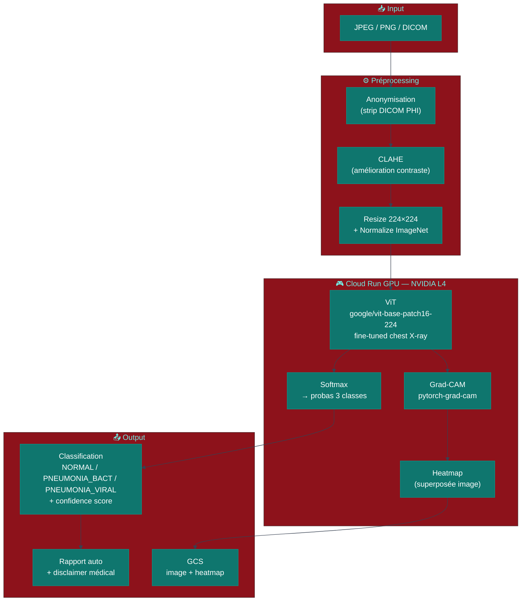
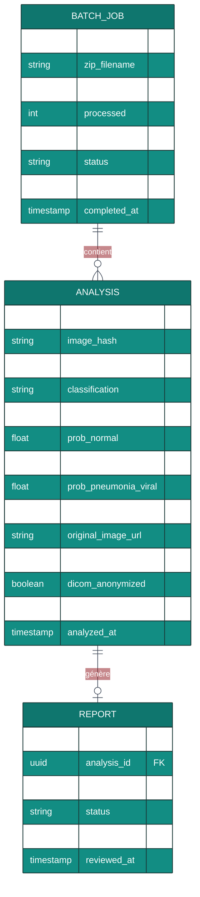

# MedicalIQA — Analyse d'imagerie médicale par Vision Transformer (Aide à la décision)

> Détectez la pneumonie sur radio thoracique en 2 secondes. Grad-CAM explique chaque décision.

> ⚠️ **AVERTISSEMENT MÉDICAL** : Cet outil est un **assistant décisionnel éducatif** uniquement. Il n'est pas certifié comme dispositif médical (CE, FDA 510k). Toute décision clinique doit être prise exclusivement par un professionnel de santé qualifié.

[](https://fastapi.tiangolo.com)
[](https://nextjs.org)
[](https://huggingface.co/google/vit-base-patch16-224)
[](https://cloud.google.com/run)
[](https://jacobgil.github.io/pytorch-gradcam-book)

---

## Table des matières
1. [Vue d'ensemble](#vue-densemble)
2. [Stack technique](#stack-technique)
3. [Architecture mono-repo](#architecture-mono-repo)
4. [Vision Transformer & Grad-CAM — Concepts techniques](#vision-transformer--grad-cam)
5. [Diagrammes UML](#diagrammes-uml)
6. [PRD](#prd)
7. [User Stories](#user-stories)
8. [Règles métier](#règles-métier)
9. [Spécification API](#spécification-api)
10. [Simulation UI](#simulation-ui)
11. [Dataset](#dataset)
12. [Déploiement Cloud Run GPU](#déploiement)
13. [CI/CD](#cicd)
14. [Roadmap](#roadmap)

---

## Vue d'ensemble

MedicalIQA fine-tune un Vision Transformer (ViT) sur le dataset chest X-ray pour la classification NORMAL / PNEUMONIA (bactérienne et virale). Chaque prédiction est accompagnée d'une **heatmap Grad-CAM** superposée à la radio pour expliquer quelles régions ont influencé la décision. Le modèle tourne sur GCP Cloud Run GPU.

**Domaine :** Santé / Medical AI (Decision Support)  
**Dataset :** [Chest X-Ray Images (Pneumonia) — Kaggle](https://www.kaggle.com/datasets/paultimothymooney/chest-xray-pneumonia) — 5 856 images X-ray  
**Infrastructure :** GCP Cloud Run GPU (NVIDIA L4) — atr.guillaume@gmail.com

---

## Vision Transformer & Grad-CAM — Concepts techniques

### Vision Transformer (ViT)
ViT découpe l'image en **patchs 16×16** et les traite comme une séquence de tokens (comme BERT pour le texte) :

```
Image 224×224 → 196 patchs 16×16 → Linear projection → 196 tokens 768-dim
+ [CLS] token → Transformer (12 couches, 12 têtes attention) → MLP head → classes
```

**Transfer learning :** `google/vit-base-patch16-224` pré-entraîné sur ImageNet-21k → fine-tuning sur chest X-rays avec learning rate différentiel (couches hautes : 1e-4, couches basses : 1e-5).

**Data augmentation pour X-rays :**
```python
train_transforms = Compose([
    RandomHorizontalFlip(p=0.5),
    RandomRotation(degrees=10),
    CLAHE(clip_limit=2.0),   # Améliore contraste bas X-rays
    GaussianBlur(kernel_size=3, p=0.2),
    Normalize(mean=[0.485, 0.456, 0.406], std=[0.229, 0.224, 0.225]),
])
```

### Grad-CAM (Gradient-weighted Class Activation Mapping)
Grad-CAM identifie les régions de l'image qui ont le plus influencé la prédiction :

1. **Forward pass** : calcule les feature maps de la dernière couche conv/attention
2. **Backward pass** : calcule les gradients de la classe prédite par rapport à ces feature maps
3. **Global Average Pooling** des gradients → poids d'importance par channel
4. **Combinaison linéaire** : Σ(poids × feature_map) → activation map
5. **ReLU + normalisation** → heatmap [0, 1] superposée sur l'image originale

```python
from pytorch_grad_cam import GradCAM
from pytorch_grad_cam.utils.image import show_cam_on_image

cam = GradCAM(model=vit_model, target_layers=[vit_model.vit.encoder.layer[-1]])
grayscale_cam = cam(input_tensor=image_tensor, targets=[ClassifierOutputTarget(pred_class)])
visualization = show_cam_on_image(original_image, grayscale_cam, use_rgb=True)
```

---

## Stack technique

| Couche | Technologie | Rôle |
|--------|------------|------|
| Frontend | Next.js 14, TypeScript, Tailwind CSS | Upload image, heatmap overlay, rapport |
| Backend | FastAPI (Python 3.11), asyncio | API inference, anonymisation DICOM |
| ViT Inference | **Transformers** (ViT), **torchvision**, PyTorch 2.3 | Classification pneumonie |
| Explainability | **pytorch-grad-cam** | Heatmap Grad-CAM sur dernière couche ViT |
| Preprocessing | **opencv-python**, **Pillow**, **pydicom** | CLAHE, resize, DICOM parsing + anonymisation |
| Storage | GCS (images anonymisées, heatmaps) | Cloud storage |
| Base de données | PostgreSQL 16 | Analyses, rapports, audit trail |
| Infrastructure | **GCP Cloud Run GPU** (NVIDIA L4) | Inference GPU |
| CI/CD | GitHub Actions → Cloud Build → Cloud Run | Deploy |

### backend/requirements.txt
```
fastapi==0.111.0
uvicorn[standard]==0.29.0
transformers==4.41.2
torch==2.3.0
torchvision==0.18.0
pytorch-grad-cam==1.5.2
opencv-python-headless==4.9.0.80
Pillow==10.3.0
pydicom==2.4.4
google-cloud-storage==2.17.0
asyncpg==0.29.0
sqlalchemy[asyncio]==2.0.30
pydantic==2.7.1
```

---

## Architecture mono-repo

```
medicaliqa/
├── frontend/
│   ├── src/app/
│   │   ├── page.tsx               # Interface d'analyse principale
│   │   ├── batch/                 # Upload ZIP → analyse en lot
│   │   └── history/               # Historique des analyses
│   └── src/components/
│       ├── ImageUpload.tsx        # Drag & drop image/DICOM
│       ├── HeatmapOverlay.tsx     # Superposition Grad-CAM interactive
│       ├── ConfidenceGauge.tsx    # Jauge de confiance 0-100%
│       ├── DiagnosisCard.tsx      # Résultat + disclaimer médical
│       └── ReportGenerator.tsx   # Génération rapport PDF
├── backend/
│   ├── app/
│   │   ├── main.py
│   │   ├── routers/
│   │   │   ├── analyze.py         # POST /analyze
│   │   │   ├── batch.py           # POST /batch (ZIP)
│   │   │   └── reports.py         # GET /reports/{id}
│   │   ├── services/
│   │   │   ├── classifier.py      # ViT inference + post-processing
│   │   │   ├── gradcam.py         # Grad-CAM heatmap generation
│   │   │   ├── preprocessor.py    # CLAHE, resize, normalize
│   │   │   ├── anonymizer.py      # Strip DICOM PHI metadata
│   │   │   └── report.py          # Auto-generate text report
│   │   └── models/
│   │       └── analysis.py
│   ├── ml/
│   │   ├── train.py               # Fine-tuning ViT script
│   │   └── artifacts/             # vit_chest_xray.pt (gitignored)
│   ├── requirements.txt
│   └── Dockerfile
├── cloudbuild.yaml
└── .github/workflows/deploy.yml
```

---

## Diagrammes UML

### Pipeline d'analyse



### Séquence — Analyse complète

```mermaid
%%{init: {'theme': 'base', 'themeVariables': {'primaryColor': '#0f766e', 'primaryTextColor': '#fff', 'lineColor': '#374151'}}}%%
sequenceDiagram
    participant U as Médecin / Utilisateur
    participant API as FastAPI (Cloud Run GPU)
    participant PRE as Preprocessor
    participant VIT as ViT Model
    participant CAM as Grad-CAM
    participant GCS as Google Cloud Storage
    participant PG as PostgreSQL

    U->>API: POST /analyze (image file)
    API->>PRE: anonymize_dicom(image)
    API->>PRE: clahe_enhance(image)
    API->>PRE: normalize_resize(224×224)

    API->>VIT: forward(image_tensor)
    VIT-->>API: logits → softmax → {NORMAL:0.08, PNEUMONIA_BACT:0.87, PNEUMONIA_VIRAL:0.05}

    Note over API: confidence = 0.87 → classe PNEUMONIA_BACT

    API->>CAM: generate_gradcam(image, target_class=PNEUMONIA_BACT)
    CAM-->>API: heatmap_overlay PNG

    API->>GCS: upload(original_image, heatmap)
    API->>PG: INSERT analysis (result, confidence, urls, model_version)

    API-->>U: {
      "classification": "PNEUMONIA_BACTERIAL",
      "confidence": 0.87,
      "heatmap_url": "https://storage.googleapis.com/...",
      "report": "Analyse IA : signes compatibles avec pneumonie bactérienne...",
      "disclaimer": "Outil d'aide à la décision — consultation médicale requise",
      "model_version": "v1.2.0"
    }
```

### Modèle de données (ER)



---

## PRD

### Problème
Dans les pays à ressources limitées, le ratio radiologues/patients est insuffisant (0.3 radiologue pour 100 000 habitants en Afrique subsaharienne vs 10+ en Europe). La pneumonie tue 2.5M enfants/an, principalement par diagnostic tardif. Un outil d'aide numérique accessible via web peut accélérer le triage.

### Solution
ViT fine-tuné sur chest X-rays → classification en 2s avec heatmap Grad-CAM pour transparence. Rapport auto-généré en langage naturel avec disclaimer médical obligatoire. Accessible via API REST.

### ⚠️ Contraintes éthiques et légales
- **Pas de dispositif médical certifié** : CE, FDA 510k non obtenus
- **Usage éducatif et de démonstration uniquement**
- **Disclaimer obligatoire** sur chaque résultat affiché
- **Anonymisation** systématique des données patient (RGPD, HIPAA)
- **Audit trail** complet (chaque analyse loggée avec model version)

### Utilisateurs cibles
| Persona | Contexte |
|---------|----------|
| Médecin généraliste | Second avis rapide avant référence radiologue |
| Chercheur médical | Évaluation d'algorithmes de computer vision médicale |
| Étudiant en médecine | Apprentissage de la lecture de radios thoraciques |

---

## User Stories

```
US-01 [Médecin] En tant que médecin,
      je veux uploader une radio thoracique
      et obtenir une classification + heatmap en 5 secondes
      afin d'avoir un second avis numérique avant la consultation radiologue.

US-02 [Système] En tant que moteur d'analyse,
      je veux afficher le disclaimer médical obligatoire sur chaque résultat
      afin de prévenir toute utilisation comme substitut au diagnostic médical.

US-03 [Chercheur] En tant que chercheur,
      je veux uploader un ZIP de 100 radios
      et obtenir un CSV de résultats en batch
      afin d'évaluer les performances du modèle sur mon dataset.

US-04 [Médecin] En tant que médecin,
      je veux voir la heatmap Grad-CAM superposée à la radio
      afin de comprendre quelles zones ont déclenché la classification.

US-05 [Système] En tant que pipeline,
      je veux anonymiser les métadonnées DICOM (nom, date de naissance...)
      avant tout stockage ou traitement
      afin de respecter le RGPD et HIPAA.
```

---

## Règles métier

| # | Règle | Description | Simulable UI |
|---|-------|-------------|-------------|
| R1 | Seuil confiance bas | < 70% → "Résultat ambigu — consultation requise" | ✅ Gauge couleur |
| R2 | Alerte urgente | > 90% Pneumonia → badge "Revue urgente" | ✅ |
| R3 | Grad-CAM obligatoire | Heatmap générée pour toute prédiction | ✅ Overlay toggle |
| R4 | Anonymisation DICOM | Strip PHI (nom, ID, DOB) avant traitement | ✅ Badge "Anonymisé" |
| R5 | Disclaimer permanent | Affiché sur chaque résultat, non ignorable | ✅ Banner UI |
| R6 | Audit trail | Chaque analyse : image_hash, modèle, timestamp | ✅ History page |
| R7 | Model versioning | Version du modèle loggée dans chaque résultat | ✅ Badge version |
| R8 | Batch max | 100 images par job (ZIP upload) | ✅ Limit visible |
| R9 | Suppression images | Images supprimées de GCS après 24h (paramétrable) | ✅ Config visible |
| R10 | Flag pour révision | Médecin peut marquer pour relecture radiologue | ✅ Flag button |

---

## Spécification API

**Base URL :** `https://medicaliqa.wikolabs.com/api/v1`

### POST /analyze
```
Content-Type: multipart/form-data
file: chest_xray.jpg (ou .dcm DICOM)
```
```json
{
  "analysis_id": "uuid",
  "classification": "PNEUMONIA_BACTERIAL",
  "confidence": 0.87,
  "probabilities": {"NORMAL": 0.08, "PNEUMONIA_BACTERIAL": 0.87, "PNEUMONIA_VIRAL": 0.05},
  "heatmap_url": "https://storage.googleapis.com/medicaliqa-outputs/heatmap_uuid.png",
  "report": "Analyse IA : opacités lobaires inférieures droites compatibles avec foyer pneumonique bactérien. Indice de confiance : 87%.",
  "disclaimer": "⚠️ Cet outil est un assistant décisionnel uniquement — non substitut d'un professionnel de santé qualifié.",
  "model_version": "vit-chest-xray-v1.2.0",
  "latency_ms": 1840
}
```

### POST /batch
Upload ZIP → analyse asynchrone → CSV résultats.

### GET /reports/{id}
Retourne le rapport complet avec méta-données (image_hash, model_version, anonymization_status).

---

## Simulation UI

Mode démo avec **images X-ray embarquées** (échantillon du dataset public).

| Composant | Description |
|-----------|-------------|
| **Drag & Drop Zone** | Upload image ou sélection depuis 10 images démo embarquées |
| **Processing Spinner** | Animation "Analyse ViT en cours..." (2s simulé) |
| **Confidence Gauge** | Jauge 0–100% avec seuils NORMAL/AMBIGUOUS/PNEUMONIA |
| **Heatmap Slider** | Superposition Grad-CAM avec opacité réglable (0–100%) |
| **Report Card** | Rapport texte + disclaimer médical en évidence |
| **Batch Upload** | Upload ZIP → tableau progression → CSV download |
| **Model Card** | Métriques publiques du modèle (accuracy, AUC, precision par classe) |

---

## Dataset

**Kaggle :** [Chest X-Ray Images (Pneumonia) — Paul Mooney](https://www.kaggle.com/datasets/paultimothymooney/chest-xray-pneumonia)

```bash
kaggle datasets download -d paultimothymooney/chest-xray-pneumonia -p backend/ml/data/
```

**Contenu :** 5 856 images X-ray pédiatriques (Guangzhou Women and Children's Medical Center) :
- **NORMAL** : 1 583 images
- **PNEUMONIA** : 4 273 images (bactérienne + virale, non distinguées dans ce dataset — annotations augmentées)

**Split :** train (5 216) / val (16) / test (624)

**Performance attendue après fine-tuning ViT :**
- Accuracy : ~92%
- AUC-ROC : ~0.97
- Recall Pneumonia : >95% (priorité clinique)

---

## Déploiement Cloud Run GPU

### cloudbuild.yaml
```yaml
steps:
  - name: gcr.io/cloud-builders/docker
    args: [build, -t, gcr.io/$PROJECT_ID/medicaliqa, ./backend]
  - name: gcr.io/cloud-builders/docker
    args: [push, gcr.io/$PROJECT_ID/medicaliqa]
  - name: gcr.io/google.com/cloudsdktool/cloud-sdk
    args:
      - gcloud
      - run
      - deploy
      - medicaliqa
      - --image=gcr.io/$PROJECT_ID/medicaliqa
      - --region=us-central1
      - --gpu=1
      - --gpu-type=nvidia-l4
      - --memory=8Gi
      - --cpu=4
      - --max-instances=3
      - --timeout=120s
```

---

## CI/CD

```yaml
name: Deploy MedicalIQA
on:
  push:
    branches: [main]
jobs:
  deploy:
    runs-on: ubuntu-latest
    steps:
      - uses: actions/checkout@v4
      - uses: google-github-actions/auth@v2
        with:
          credentials_json: ${{ secrets.GCP_SA_KEY }}
      - uses: google-github-actions/setup-gcloud@v2
      - run: gcloud builds submit --config cloudbuild.yaml
```

---

## Roadmap

### Phase 1 — MVP (Semaines 1–4)
- [ ] Fine-tuning ViT sur chest X-ray dataset
- [ ] Grad-CAM heatmap overlay
- [ ] FastAPI inference endpoint (Cloud Run GPU)
- [ ] UI upload + résultat + disclaimer

### Phase 2 — Qualité (Semaines 5–8)
- [ ] Anonymisation DICOM complète (pydicom)
- [ ] Batch analysis (ZIP upload)
- [ ] Rapport PDF auto-généré
- [ ] Audit trail complet

### Phase 3 — Extension (Semaines 9–12)
- [ ] Multi-classe : TB, pleural effusion, cardiomegaly
- [ ] DICOM viewer intégré
- [ ] Segmentation (U-Net) des zones pathologiques
- [ ] Intégration FHIR (échange données hospitalières)

---

*Un produit [Wikolabs](https://wikolabs.com) — Intelligence artificielle appliquée aux métiers*
